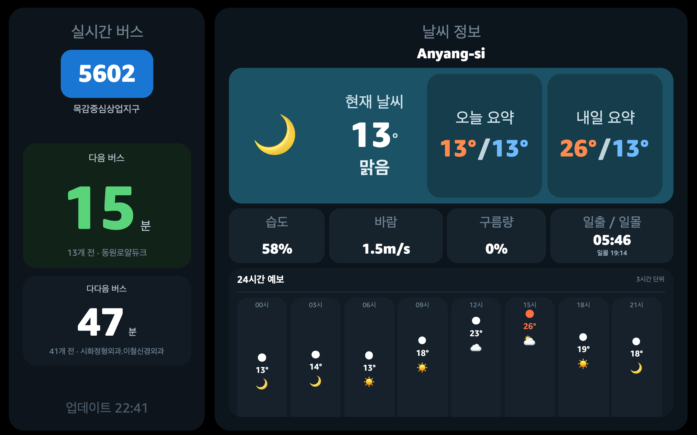

# BusWatch Home

Echo Show 10/15에서 실시간 버스 도착 정보를 표시하는 Alexa Custom Skill.

```
"Alexa, open next bus"
```

경기도 버스 도착 정보를 Echo Show 디스플레이에 한눈에 보여줍니다.
노선 타입에 따라 파란색(간선), 빨간색(직행좌석/광역), 초록색(마을) 버스가 구분되어 표시됩니다.



---

## 아키텍처

```
GBIS 공공데이터 API
       ↓
FastAPI Backend (Python 3.12)
       ↓
Alexa Skill (HTTPS)
       ↓
Echo Show 10/15 (APL 디스플레이)
```

## 프로젝트 구조

```
echo-bus/
├── .env.example                      # 환경변수 템플릿
├── .gitignore
├── Makefile                          # 빌드·배포 자동화 (make deploy)
├── README.md
├── docs/
│   ├── bus.md                        # GBIS API 레퍼런스
│   ├── infrastructure.md             # 인프라 환경 구성 (네트워크, 서버)
│   └── cicd.md                       # CI/CD 자동화 방안
├── scripts/
│   └── deploy.sh                     # 원클릭 배포 스크립트
├── backend/
│   ├── app/
│   │   ├── main.py                   # FastAPI 엔트리포인트
│   │   ├── config.py                 # 환경변수 + 동적 설정 (settings.json)
│   │   ├── gbis/
│   │   │   └── client.py             # GBIS 도착정보 API 클라이언트 (httpx)
│   │   ├── weather/
│   │   │   └── client.py             # OpenWeatherMap 날씨 API 클라이언트
│   │   ├── alexa/
│   │   │   ├── handler.py            # Alexa Intent 핸들러
│   │   │   └── apl.py                # APL 문서 로더
│   │   ├── apl_documents/
│   │   │   └── bus_arrival.json      # APL 디스플레이 템플릿
│   │   └── static/
│   │       ├── settings.html         # 정류소/노선 설정 웹 UI
│   │       └── preview.html          # APL 미리보기
│   ├── requirements.txt
│   ├── Dockerfile
│   ├── docker-compose.yml            # 이미지 빌드 전용
│   └── docker-compose.truenas.yml    # TrueNAS Custom App 실행용
└── skill-package/
    ├── skill.json                    # Alexa Skill 매니페스트 (en-US)
    └── interactionModels/custom/
        └── en-US.json                # 인터랙션 모델
```

## 주요 기능

| 기능 | 설명 |
|------|------|
| 실시간 도착 표시 | 다음 버스 / 다다음 버스 도착 시간 (분) |
| APL 디스플레이 | 다크 테마, 버스 타입별 색상 (파란/빨간/초록) |
| 자동 갱신 | APL handleTick + SendEvent로 60초 간격 |
| 세션 유지 | reprompt + handleTick으로 5분간 화면 유지 |
| 도착 시간 컬러코딩 | 3분 이하 빨강, 7분 이하 주황, 그 외 초록 |
| 한국어 표시 | 디스플레이·TTS 모두 한국어 |
| 영어 호출 | "Alexa, open next bus" (en-US) |
| 설정 UI | 웹에서 정류소/노선 변경 가능 (`/settings`) |
| 운행 종료 표시 | 심야 등 운행 종료 시 🌙 + 안내 메시지 (PASS flag + 도착 예정 시간 없을 때) |
| 오류 처리 | API 장애 시 ⚠️ + 오류 화면 표시 |

## 버스 색상 구분

| 색상 | 타입 | 예시 |
|------|------|------|
| 🔵 파란색 | 일반형시내버스 (간선) | 5601, 5602 |
| 🔴 빨간색 | 직행좌석형시내버스 (광역) | 3300, 6501 |
| 🟢 초록색 | 마을버스 | 6, 6-1 |

GBIS API의 `routeTypeName`을 기반으로 자동 분류됩니다.

## API 엔드포인트

| Method | Path | 용도 |
|--------|------|------|
| `POST` | `/alexa` | Alexa Skill 요청 처리 |
| `GET` | `/health` | 헬스체크 |
| `GET` | `/api/bus-arrival` | GBIS 도착 정보 직접 조회 (디버깅용) |
| `GET` | `/settings` | 설정 웹 UI |
| `GET` | `/api/settings` | 현재 설정 조회 |
| `PUT` | `/api/settings` | 설정 저장 |
| `GET` | `/api/stations/search?keyword=` | 정류소 검색 |
| `GET` | `/api/stations/{id}/routes` | 정류소 경유 노선 조회 |

## 음성 명령

| 명령 | 예시 |
|------|------|
| 스킬 열기 | "Alexa, open next bus" |
| 도착 조회 | "Alexa, ask next bus for arrival time" |
| 도움말 | "Alexa, ask next bus for help" |
| 종료 | "Alexa, stop" |

---

## 로컬 개발

### 1. 환경 설정

```bash
cp .env.example .env
# .env 파일을 열어 API 키와 기본 정류소/노선 설정
```

### 2. 가상환경 & 실행

```bash
cd backend
python3 -m venv .venv
.venv/bin/pip install -r requirements.txt
.venv/bin/uvicorn app.main:app --host 0.0.0.0 --port 8080 --app-dir .
```

### 3. 테스트

```bash
curl http://localhost:8080/health
curl http://localhost:8080/api/bus-arrival
open http://localhost:8080/settings
```

### Step 4 — Alexa Developer Console 설정

1. [developer.amazon.com](https://developer.amazon.com/alexa/console/ask) 접속
2. **Create Skill** → Custom → Provision your own
3. **Invocation Name**: `next bus`
4. **JSON Editor**: `skill-package/interactionModels/custom/en-US.json` 붙여넣기
5. **Endpoint** → HTTPS:
   - Default Region: `https://<YOUR_DOMAIN>/alexa`
   - SSL: "My development endpoint has a certificate from a trusted certificate authority"
6. **Interfaces** → Alexa Presentation Language 활성화
7. **Save** → **Build** → **Test** 탭에서 Development 모드
8. 테스트: "open next bus"

### 배포 (TrueNAS)

`make deploy` 한 줄로 rsync → Docker 빌드 → 컨테이너 재시작 → 헬스체크를 자동 수행합니다.

```bash
make deploy        # 원클릭 배포 (sync → build → restart → health check)
make sync          # 소스 동기화만
make build         # sync + 이미지 빌드
make logs          # 컨테이너 실시간 로그
make health        # 헬스체크
```

또는 독립 스크립트를 사용할 수 있습니다:

```bash
./scripts/deploy.sh          # 기본 배포
./scripts/deploy.sh --test   # 테스트 후 배포
```

인프라 환경 상세는 `docs/infrastructure.md`, CI/CD 고도화 방안은 `docs/cicd.md`를 참조하세요.

### 컨테이너 관리

TrueNAS 웹 UI (Apps 페이지)에서 bus-watch 앱의 시작/중지/재시작을 관리합니다.

SSH로 로그 확인:

```bash
sudo docker logs --tail 50 buswatch-backend  # 로그
```

---

## 설정 변경

### 웹 UI (권장)

브라우저에서 `https://<YOUR_DOMAIN>/settings` 접속:

1. 정류소 이름 또는 번호로 검색
2. 경유 노선 목록에서 선택
3. 저장 → **서버 재시작 없이 즉시 반영**

### .env (기본값)

`.env` 파일의 `STATION_ID`, `ROUTE_ID` 등을 수정하면 기본값이 변경됩니다.
`settings.json`에 값이 있으면 그쪽이 우선합니다.

---

## GBIS API 참고

| API | 일일 제한 | 용도 |
|-----|----------|------|
| getBusArrivalItemv2 | 1,000회 | 특정 노선 도착 정보 |
| getBusStationListv2 | 1,000회 | 정류소 검색 |
| getBusStationViaRouteListv2 | 1,000회 | 경유 노선 조회 |

실사용 시 API 호출량: 약 60회/일 (출퇴근 시간대 각 30분, 60초 간격)

---

## 기술 스택

- **Backend**: Python 3.12 / FastAPI / uvicorn
- **GBIS API 클라이언트**: httpx (비동기)
- **Alexa SDK**: ask-sdk-core + ask-sdk-webservice-support
- **디스플레이**: APL 2024.3
- **배포**: Docker / TrueNAS Custom App
- **리버스 프록시**: Apache 2.4 (<PROXY_IP>)
- **SSL**: acme.sh (Let's Encrypt, EC-256)
- **설정**: pydantic-settings + settings.json 동적 오버라이드
